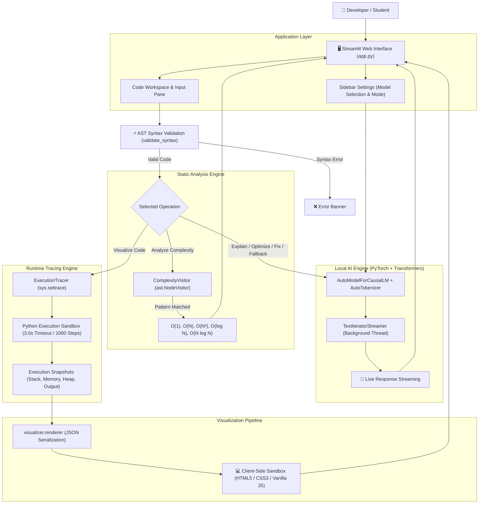

# ⚡ Code Mentor AI

> **High-Performance Hybrid Static-AI Developer Assistant & Python Execution Visualizer**

[](https://www.python.org/)
[](https://streamlit.io/)
[](https://pytorch.org/)
[](https://huggingface.co/)
[](#license)

---

## 📖 Overview

**Code Mentor AI** is an interactive developer assistant and visual educational environment engineered to help programmers run, debug, analyze, optimize, explain, and visually execute Python code in real time.

Standard AI coding assistants rely exclusively on Large Language Models (LLMs) to answer questions about code behavior. This approach can lead to hallucinations, inaccurate step-by-step state representations, and high latency. **Code Mentor AI overcomes these limitations by implementing a multi-layered hybrid architecture**:

1. **Deterministic Static Analysis (AST):** Instantly parses code structures to validate syntax and calculate Big-O time and space complexity without invoking AI models.
2. **Dynamic Runtime Tracing (`sys.settrace()`):** Executes Python code in a safe sandbox to capture real, ground-truth execution snapshots across every line instruction.
3. **Local AI Inference (PyTorch & HF Transformers):** Employs lightweight open-source causal language models locally for natural-language explanations, optimizations, and deep logical bug scanning.
4. **Interactive Sandbox Visualizer:** Translates recorded runtime snapshots into a responsive, client-side HTML5/CSS3/JavaScript interface for step-by-step visual debugging.

---

## ✨ Key Features

### 🤖 AI-Powered Code Assistance

Every AI capability is powered by local Hugging Face Causal Language Models running locally via PyTorch.

* **Code Explanation:** Generates structured, line-by-line summaries explaining algorithm logic. Supports **Fast Mode** (3 concise bullet points) and **Detailed Mode** (thorough breakdown).
* **Code Optimization:** Rewrites submitted Python code into clean, idiomatic algorithms while returning a bulleted changelog detailing performance improvements.
* **Error Fixing:** Statically and dynamically validates code before querying the AI model. If an error is caught, the local model generates a target fix and an explanation. If no errors are detected, users can trigger a **Deep Logical AI Verification** scan.
* **Streaming Responses:** Streams generated tokens in real time via Hugging Face `TextIteratorStreamer` running on a background thread.
* **Model Selection:** Supports seamless switching between local instruct-tuned coding models directly from the sidebar:
  * `Qwen 2.5 Coder 0.5B` (*Qwen/Qwen2.5-Coder-0.5B-Instruct*) — Default, optimized for fast CPU inference.
  * `DeepSeek Coder 1.3B` (*deepseek-ai/deepseek-coder-1.3b-instruct*) — Balanced model for reasoning accuracy.
  * `Qwen 2.5 Coder 1.5B` (*Qwen/Qwen2.5-Coder-1.5B-Instruct*) — Highest accuracy for complex code analysis.

### ⚡ Static Code Analysis

A deterministic AST analysis engine processes code prior to or instead of invoking the LLM, enabling near-instant (sub-second) feedback.

* **Syntax Validation:** Uses Python's `ast.parse()` and `compile()` to verify code validity and isolate line-specific syntax errors.
* **Big-O Complexity Estimation:** Employs a custom `ComplexityVisitor(ast.NodeVisitor)` to inspect loop depth, sequence chaining, binary search operations, sorting calls (`sorted()`, `.sort()`), lookups (`dict`, `set`), and allocations.
* **Deterministic Results:** Returns $O(1)$, $O(\log N)$, $O(N)$, $O(N^2)$, $O(N^k)$, and $O(N \log N)$ complexity metrics with zero LLM inference latency.

### 🏃 Runtime Analysis

Provides safe local execution and telemetry.

* **Local Sandbox Execution:** Runs Python code locally while capturing `stdout` and `stderr` buffers.
* **Runtime Exception Catching:** Intercepts exceptions, extracts exact stack trace frames, and highlights offending source lines.
* **Standard Input Handling:** Supports interactive user inputs (`stdin`) via string buffer mapping.

### 🐍 Interactive Python Execution Visualizer

A major highlight of Code Mentor AI is its step-by-step visual code debugger.

* **Instruction Line Tracing:** Highlights active lines and smoothly updates an animated execution pointer (`▶`).
* **Memory & Variables (Stack):** Displays scalar local and global variables with scope tags and value types.
* **Data Structures (Heap):** Visualizes lists, tuples, and sets as indexed cell grids, and dictionaries as key-value tables.
* **State Transition Animations:** Triggers CSS flash highlights (`#3fb950`) whenever variable values or collection cells change between steps.
* **Loop Iteration Visualizer:** Displays loop headers, target variables, and current vs. total iteration metrics (e.g., `Iteration 2 / 5`).
* **Conditional Path Evaluation:** Displays `if`/`elif` expressions with a `TRUE` or `FALSE` status badge, listing all variables evaluated in the branch check.
* **🥞 Call Stack Monitoring:** Tracks active function frames, arguments, function signatures, line numbers, and frame depths.
* **Return Value Capture:** Records return values and types when exiting function frames.
* **Console Output Buffer:** Displays live standard output (`stdout`) printed up to the active step.
* **Full Playback Controls:** Includes **Play**, **Pause**, **Prev Step**, **Next Step**, **Restart**, an interactive **Timeline Slider**, and a **Speed Slider** ($0.25\times$ to $2.00\times$).

---

## 🧠 Why Hybrid Analysis?

Relying exclusively on Large Language Models for code execution analysis presents fundamental trade-offs: LLMs can hallucinate variable states, miscalculate loop bounds, and introduce latency for basic syntax checks.

Code Mentor AI addresses this by dividing tasks across specialized system layers:

| Layer | Responsibility | Mechanism | Benefit |
| :--- | :--- | :--- | :--- |
| **Deterministic Layer** | Syntax checking, Big-O estimation, code execution, traceback profiling | Python `ast` module, `compile()`, `sys.settrace()` | Guaranteed accuracy, zero hallucinations, instant sub-second execution. |
| **AI Layer** | Natural-language explanation, code refactoring, logic auditing | Hugging Face Transformers, PyTorch | Intelligent reasoning and conversational explanations where static rules fall short. |
| **Visualization Layer** | Interactive rendering of execution snapshots | Client-side HTML5 / CSS3 / JavaScript Sandbox | Smooth step-by-step visual learning experience without server rendering flicker. |

---

## 🔄 End-to-End Workflow

```text
                  User Enters Python Code
                            │
                            ▼
              Streamlit Web Interface (app.py)
                            │
                            ▼
             Static AST Validation (ast.parse)
             ┌──────────────┴──────────────┐
       [Valid Syntax]              [Syntax Error]
             │                             │
             ▼                             ▼
    Operation Selection             Display Line Error
  ┌──────────┼──────────┐
  │          │          │
  ▼          ▼          ▼
Run Code   AI Tasks   Visualize Code
 (Exec)    (LLM)      (Tracer Engine)
  │          │          │
  │          │          ▼
  │          │      sys.settrace() Pipeline
  │          │          │
  │          │          ▼
  │          │      Record Execution Snapshots
  │          │          │
  │          │          ▼
  │          │      JSON Serialization
  │          │          │
  │          │          ▼
  │          │      Client-Side JS Sandbox
  └──────────┴──────────┘
             │
             ▼
      Render Results / Visualization
```

---

## 🏛️ System Architecture



---

## 🤖 AI/ML Engine

The AI subsystem operates entirely on local hardware using PyTorch and Hugging Face Transformers.

* **Local Inference Pipeline:** Uses `AutoModelForCausalLM` and `AutoTokenizer` configured with `low_cpu_mem_usage=True`.
* **Precision Modes:** Automatically selects `bfloat16` or `float16` when an NVIDIA CUDA GPU is present, defaulting to `float32` on CPU.
* **Streaming Engine:** Implements `TextIteratorStreamer` running inside a Python `Thread`, allowing tokens to render in the Streamlit UI as they are generated.
* **Model Selection & Trade-Offs:**
  * **Qwen 2.5 Coder 0.5B:** Ultra-lightweight ($~0.5\text{B}$ parameters). Recommended for CPU inference; generates responses in seconds.
  * **DeepSeek Coder 1.3B:** Mid-tier model ($~1.3\text{B}$ parameters). Provides balanced reasoning for complex logic.
  * **Qwen 2.5 Coder 1.5B:** High-precision model ($~1.5\text{B}$ parameters). Best suited for GPU-accelerated environments.
* **Model Caching:** Utilizes Streamlit's `@st.cache_resource` and session state caching (`st.session_state.loaded_models`) to avoid reloading weights when switching tasks.
* **Response Caching:** Implements an in-memory SHA256 prompt response cache (`get_cache_key`) to return instant results for duplicate queries.

---

## ⚡ Static Analysis Engine

The static analyzer inspects code without executing it or calling AI models.

```text
Python Source Code
        │
        ▼
   ast.parse()
        │
        ▼
AST Abstract Syntax Tree
        │
        ▼
ComplexityVisitor (ast.NodeVisitor)
        │
        ├─► Track loop depth (visit_For, visit_While)
        ├─► Inspect recursion (visit_FunctionDef)
        ├─► Detect binary search divisions (ast.FloorDiv, ast.Div, ast.RShift)
        ├─► Detect sorting calls (sorted, .sort())
        └─► Track collections & allocations (ListComp, DictComp, append, etc.)
        │
        ▼
Deterministic Complexity Output: O(1), O(N), O(N²), O(log N), O(N log N)
```

> [!NOTE]
> Static complexity checks offer fast pattern matching. If code contains complex recursion or non-standard control flow, the engine defers complexity estimation to the local LLM.

---

## 🔬 Runtime Tracing Engine

The tracer engine (`visualizer/tracer.py`) monitors Python code execution step-by-step via Python's built-in `sys.settrace()` hook.

### Tracing Mechanism
1. **Scope Filtering:** Filters execution frames to track only `<user_code>`, ignoring standard library internal calls.
2. **Event Callback:** Captures `'line'`, `'call'`, `'return'`, and `'exception'` events.
3. **State Capture & Serialization:**
   * **Call Stack:** Reconstructs parent frames, active line numbers, function names, and argument signatures (e.g., `fibonacci(n=5)`).
   * **Variables (Locals & Globals):** Captures primitive variables and deep-serializes nested collections up to a max depth of 3 and a max element cap of 100 per container.
   * **Output Interception:** Replaces `sys.stdout` with a custom `StdoutInterceptor` to maintain an accumulated string buffer for each step.
   * **Exceptions & Returns:** Captures exception types, error strings, and return values upon function frame exit.

---

## 🎨 Visualization Pipeline

```text
   Raw Trace Snapshots
          │
          ▼
   visualizer/renderer.py
          │
          ▼
  safe_json_dumps()  (Prevents script injection)
          │
          ▼
  Embedded HTML5 / CSS3 / JS Application
          │
          ▼
  streamlit.components.v1.html(height=760)
          │
          ▼
  Client-Side DOM Rendering (Independent JavaScript Event Loop)
```

### Visual Panels
* **Source Code View:** Renders line-numbered source code with active line highlighting and an animated SVG/CSS pointer (`▶`).
* **Memory Card:** Displays primitive variables (`int`, `float`, `str`, `bool`) with scope badges (`local`/`global`).
* **Heap Data Structures Card:** Formats complex collections (lists, tuples, sets, dicts) as cell grids or tables.
* **Loop & Conditional Cards:** Displays contextual iteration banners and boolean evaluation checks.
* **Call Stack Panel:** Visualizes active function execution stacks.
* **Console Output:** Shows standard output generated up to the current step.

---

## 🎬 Visualizer Example

Consider the following list accumulation script:

```python
numbers = [1, 2, 3]
total = 0

for number in numbers:
    total += number

print(total)
```

### Step-by-Step Visualizer Output

| Step | Line | Event | Active State & Visualizer Behavior |
| :---: | :---: | :---: | :--- |
| **1** | `Line 1` | `line` | `numbers` list initialized on Heap: `[1, 2, 3]` with indices `[0, 1, 2]`. |
| **2** | `Line 2` | `line` | `total` scalar variable created in Memory with value `0`. |
| **3** | `Line 4` | `line` | Loop starts. Loop card displays **Iteration 1 / 3**. Target variable `number` set to `1`. |
| **4** | `Line 5` | `line` | `total` updates from `0` to `1`. Variable card triggers green flash animation (`.flash-change`). |
| **5** | `Line 4` | `line` | Loop continues. **Iteration 2 / 3**. Target variable `number` updates to `2`. |
| **6** | `Line 5` | `line` | `total` updates from `1` to `3` (flashes green). |
| **7** | `Line 4` | `line` | Loop continues. **Iteration 3 / 3**. Target variable `number` updates to `3`. |
| **8** | `Line 5` | `line` | `total` updates from `3` to `6` (flashes green). |
| **9** | `Line 7` | `line` | `print(total)` executes. Output `6` appears in the Console Output box. |

---

## 🛠️ Technology Stack

| Layer | Technology | Role |
| :--- | :--- | :--- |
| **Language** | Python 3.8+ | Core runtime environment. |
| **UI Framework** | Streamlit | Web interface, layout split-screens, sidebar controls, and state management. |
| **AI Inference** | PyTorch | Execution engine for tensor computations and CUDA acceleration. |
| **LLM Orchestration** | HF Transformers | Tokenization, model loading, and streaming text iteration (`TextIteratorStreamer`). |
| **Static Analysis** | Python `ast` Module | Syntax parsing, code validation, and AST complexity visitor. |
| **Runtime Engine** | `sys.settrace()` | Dynamic step tracing, call stack reconstruction, and output buffering. |
| **Visualizer Frontend**| HTML5 / CSS3 / Vanilla JS | Client-side sandbox iframe (`components.html`) rendering animated state transitions. |

---

## 📁 Project Structure

```text
code/
├── .streamlit/
│   └── config.toml          # Streamlit dark theme configuration preset
├── app.py                   # Streamlit app entrypoint, UI layout, static checkers, LLM integration
├── requirements.txt         # Project dependencies for Streamlit Community Cloud
├── visualizer/              # Execution visualizer module
│   ├── __init__.py          # Module initialization
│   ├── tracer.py            # Sandbox tracer engine (sys.settrace callback)
│   └── renderer.py          # HTML/CSS/JS visualizer generator & Streamlit iframe component
└── README.md                # Project documentation
```

### File Breakdown
* `app.py`: Sets up the Streamlit interface, sidebar model selection, AST static complexity analysis, response streaming, and action handlers.
* `requirements.txt`: Defines runtime dependencies required for local execution and Streamlit Community Cloud deployment.
* `visualizer/tracer.py`: Implements `ExecutionTracer` to execute code within a resource-bounded sandbox using `sys.settrace()`, recording execution steps.
* `visualizer/renderer.py`: Serializes execution snapshots into JSON and embeds a client-side JavaScript visualizer app using `streamlit.components.v1.html`.
* `.streamlit/config.toml`: Sets default Streamlit dark theme settings (`base="dark"`, `primaryColor="#4CAF50"`).

---

## 📦 Installation & Setup

### Prerequisites
* **Python 3.8+** installed.
* **Git** installed.
* *(Optional)* NVIDIA GPU with CUDA drivers installed for accelerated LLM generation.

### 1. Clone the Repository
```bash
git clone <repository-url>
cd code
```
*(Replace `<repository-url>` with your actual repository location).*

### 2. Create and Activate a Virtual Environment
```bash
# Windows
python -m venv venv
venv\Scripts\activate

# macOS / Linux
python3 -m venv venv
source venv/bin/activate
```

### 3. Install Dependencies
```bash
pip install -r requirements.txt
```

> [!TIP]
> **GPU Acceleration:** If an NVIDIA GPU is available, install the CUDA-supported build of PyTorch by following instructions on the [PyTorch Get Started Page](https://pytorch.org/get-started/locally/). Code Mentor AI will automatically detect CUDA and use `bfloat16`/`float16` precision.

---

## ⚙️ Configuration

* **Local Execution:** Code Mentor AI runs **locally**. No external API keys (e.g., OpenAI or Anthropic) are required.
* **Model Storage:** The application downloads model weights directly from Hugging Face on initial launch. Downloaded models are cached locally in your standard Hugging Face hub cache directory (`~/.cache/huggingface/hub`).
* **Offline Usage:** Once a model has been downloaded on first run, inference can run completely offline.

---

## 🚀 Running the Application

Launch the application via Streamlit:

```bash
streamlit run app.py
```

After starting, Streamlit will display the local network URL (typically `http://localhost:8501`).

---

## 📖 User Guide

1. **Launch App:** Run `streamlit run app.py` and open the web browser.
2. **Select AI Model:** Use the sidebar to pick your preferred model (`Qwen 2.5 Coder 0.5B` is recommended for CPU-only systems).
3. **Select Mode:** Choose between **Fast Mode** (concise responses, 150 token cap) or **Detailed Mode** (thorough responses, 500 token cap).
4. **Enter Python Code:** Paste code into the **Code Workspace** text area. Provide optional input values in the **Program Input (stdin)** box.
5. **Execute Actions:** Click one of the six operational buttons:
   * ▶️ **Run:** Execute code locally and view stdout/stderr output instantly.
   * 🧠 **Explain:** Generate a structured AI explanation of the code.
   * 🛠️ **Fix:** Validate code syntax and runtime, generating targeted fix suggestions if errors are found.
   * ⏱️ **Complex:** Statically calculate Big-O Time and Space complexity (falling back to AI if code is recursive or complex).
   * ⚡ **Optimize:** Request AI-optimized code refactorings with performance changelogs.
   * 🎬 **Visualize:** Switch to the full-screen interactive Python Execution Visualizer.
6. **Interact with Visualizer:** Use the **Play/Pause**, **Step Controls**, **Timeline Slider**, or **Speed Slider** to step through execution.

---

## 🛡️ Execution Safeguards

To prevent infinite loops, system hangs, memory exhaustion, and excessive tracing overhead, the execution tracer enforces resource limits:

| Limit Feature | Value | Safeguard Rationale |
| :--- | :--- | :--- |
| **Max Trace Steps** | `1000` steps | Prevents infinite loop execution from exceeding system memory. |
| **Execution Timeout** | `3.0` seconds | Aborts long-running functions or infinite loops via time delta checks inside trace callbacks. |
| **Output Size Cap** | `10,000` chars | Prevents browser UI slowdowns caused by runaway `print()` loops. |
| **Pre-Execution Check** | `ast.parse()` | Ensures code has valid syntax before launching trace contexts. |

> [!WARNING]
> Code Mentor AI uses standard Python execution mechanisms with `sys.settrace()` timeouts. It is intended for development, analysis, and educational usage. It does not run inside an isolated OS container (such as Docker).

---

## 🧪 Testing & Validation

Code Mentor AI currently uses **manual verification scenarios** to validate system performance and tracing stability.

### Manual Verification Matrix

| ID | Verification Scenario | Test Script | Expected Behavior |
| :---: | :--- | :--- | :--- |
| **1** | **Scalar Variables & Scope** | `x = 10; y = 20; x = x + y` | `x` and `y` render in Memory panel. Updating `x` triggers a green flash animation (`10 ➔ 30`). |
| **2** | **Heap Collections** | `arr = [1, 2]; arr.append(3)` | List elements display as cell grids `[1] [2] [3]` with indices `[0] [1] [2]`. |
| **3** | **Control Flow & Loops** | `for i in range(3): pass` | Loop card displays iteration counter (`1 / 3`, `2 / 3`, `3 / 3`) and updates target variable `i`. |
| **4** | **Conditional Paths** | `if 5 > 2: print("yes")` | Conditional card displays `if 5 > 2:` with a green `TRUE` badge, executing the inner block. |
| **5** | **Call Stack Tracing** | `def f(a): return a*2`<br>`f(5)` | Call stack panel pushes `f(a=5)` frame with depth indicator, capturing `return_value: 10` on exit. |
| **6** | **Timeout Protection** | `while True: pass` | Execution halts after 3.0 seconds, displaying a `TimeoutError` exception banner. |
| **7** | **Static Complexity** | `for i in range(n): pass` | Static analyzer instantly returns `Time: O(N)` and `Space: O(1)` without LLM latency. |

---

## 🚨 Error Handling

The application provides error feedback across execution layers:

* **Syntax Errors:** Highlights offending line numbers and error strings in a styled error box before running execution or LLM requests.
* **Runtime Exceptions:** Displays exception types (e.g., `ZeroDivisionError`, `IndexError`, `KeyError`) alongside file line pointers and error messages.
* **Timeout Violations:** Displays a warning when code execution exceeds the 3.0-second sandbox limit.
* **Model Loading Errors:** Displays a fallback warning in the sidebar if PyTorch/Transformers fails to load local models, switching the app to **Static Analysis Mode**.

---

## ⚡ Performance & Optimization

Code Mentor AI is designed for responsive interaction:

1. **Static Analysis First:** Syntax checking and simple Big-O complexity analysis run statically in under $10\text{ms}$, avoiding unnecessary LLM calls.
2. **Response Caching:** Standardized SHA256 prompt-response caching yields instant ($<1\text{ms}$) responses for repeated operations.
3. **Lightweight Default Model:** Uses `Qwen 2.5 Coder 0.5B` as the default model, enabling fast CPU execution without requiring high-end GPUs.
4. **Optimized Generation Parameters:** Fast Mode sets `max_new_tokens=150` and `temperature=0.0`, resulting in faster output generation.
5. **Client-Side Rendering:** Execution visualizer rendering runs entirely on the browser's JavaScript event loop, delivering smooth animation transitions without Streamlit re-render flickering.

---

## 🔒 Privacy & Local AI

* **100% Local Inference:** Your source code remains on your machine during AI analysis. Code is never uploaded to third-party APIs.
* **Network Independence:** An internet connection is required only on initial launch to download Hugging Face model weights. Subsequent launches run completely offline.

---

## ⚠️ Limitations

* **Python-Only Execution:** The runtime tracing engine and AST complexity analyzer support Python source code only.
* **Hardware Dependability:** Local AI performance scales with system hardware. Systems without dedicated GPUs should stick to Fast Mode with the 0.5B model.
* **Heuristic AST Bounds:** Static complexity analysis relies on AST structure matching. Highly dynamic algorithms or custom recursive patterns defer analysis to the LLM.
* **Process Sandbox Bounds:** Tracing enforcement relies on `sys.settrace()` callback limits rather than OS-level process isolation containers.

---

## 🔮 Future Enhancements

* **Multi-Language Support:** Expand static analysis and visual execution tracing to JavaScript and C++.
* **Interactive Heap Graphs:** Add node-and-pointer memory graphs for linked lists, binary trees, and graphs.
* **Automated Test Suite:** Implement PyTest suites for AST visitor rules and tracer snapshot schemas.
* **Trace Exporting:** Support exporting execution snapshots to JSON or shareable standalone HTML files.

---

## 💡 Engineering Highlights

* **Hybrid Engine Architecture:** Blends static analysis, runtime execution hooks, and local LLM inference into a unified pipeline.
* **Zero-Hallucination Visualizer:** Builds visual state trees directly from `sys.settrace()` execution snapshots instead of relying on AI-generated step guesses.
* **Flicker-Free Client-Side UI:** Embeds a single-page HTML5/JS app inside a Streamlit component iframe (`components.html`), offloading animation updates from Python to the browser DOM.
* **Graceful Degradation:** Features automatic fallback to static-only mode if AI model loading encounters memory or hardware limitations.

---

## 🎓 How I Built Code Mentor AI

> *An interview-ready summary for engineering reviews and technical discussions:*

### Problem Statement
Standard AI coding tools answer questions conversational-style but cannot reliably demonstrate step-by-step state execution. Traditional debuggers, on the other hand, display verbose raw data without contextual explanations or complexity analysis.

### Technical Solution
I engineered **Code Mentor AI**, a developer tool that pairs deterministic static analysis and dynamic runtime tracing with local open-source LLMs.

### Engineering Decisions
1. **Addressing Hallucinations:** Rather than asking an LLM to "predict" step-by-step variables, I built a tracing engine using Python's `sys.settrace()` callback. This guarantees that all memory, heap, and call stack states are $100\%$ accurate ground truths.
2. **Optimizing Latency:** LLM generation can take time on consumer hardware. To keep the app responsive, I built an AST static analysis visitor using Python's `ast` module. Simple complexity checks ($O(1)$, $O(N)$, $O(N^2)$) and syntax validations resolve statically in under 10ms.
3. **Flicker-Free UI:** Streamlit re-renders entire pages on state changes. To create a smooth visualizer experience, I built a client-side HTML5/CSS3/JavaScript application embedded inside Streamlit via `components.html`. Tracing snapshots are serialized to JSON once, and the visualizer handles timeline scrubbings, step transitions, and animations directly inside the browser DOM.
4. **Safety & Stability:** I implemented strict execution boundaries within the tracer callback, enforcing a 3.0-second execution timeout, a 1000-step trace cap, and a 10,000-character stdout limit to prevent runaway loops from crashing the app.

---

## 📝 Resume Highlights

* **Local AI Integration:** Built a local AI coding assistant using PyTorch and Hugging Face Transformers, featuring token streaming (`TextIteratorStreamer`) and dynamic quantization/device allocation (`CUDA`/`CPU`).
* **Execution Visualizer Engine:** Developed a step-by-step Python code execution visualizer using `sys.settrace()`, capturing execution frames, local/global variable states, heap data structures, call stacks, and standard output.
* **Deterministic AST Analyzer:** Implemented an AST-based static complexity analyzer (`ast.NodeVisitor`) that evaluates loop depth, binary search patterns, and collection allocations to compute Big-O Time and Space complexity instantly.
* **Client-Side Sandbox Component:** Built an interactive visual debugging interface using HTML5, CSS3, and Vanilla JavaScript embedded within Streamlit, featuring CSS state transition animations and full timeline playback controls.
* **System Safeguards & Caching:** Designed execution safeguards (step limits, execution timeouts, output buffer caps) and an in-memory SHA256 response caching system to optimize system responsiveness.

---

## 📄 License

This repository does not currently specify an open-source license. All rights reserved.